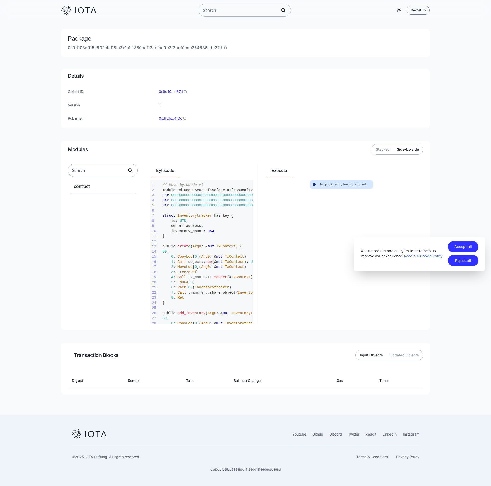

# Inventory Tracker

## Description

Inventory Tracker on-chain dApp for secure, transparent tracking on IOTA.

**Smart Contract**: [View on IOTA Explorer](https://explorer.iota.org/object/0x9d108e915e632cfa98fa2e1a1f1380caf12aefad9c3f2bef9ccc354686adc37d?network=devnet)

---

## Screenshot



---

## Explorer Link & Contract Address

- **Network**: Devnet
- **Package ID**: `0x9d108e915e632cfa98fa2e1a1f1380caf12aefad9c3f2bef9ccc354686adc37d`
- **Explorer**: [View on IOTA Explorer](https://explorer.iota.org/object/0x9d108e915e632cfa98fa2e1a1f1380caf12aefad9c3f2bef9ccc354686adc37d?network=devnet)

---

## 🚀 Quick Start

```bash
# Install dependencies
npm install --legacy-peer-deps

# Deploy the smart contract
npm run iota-deploy

# Start development server
npm run dev
```

## 💡 How It Works

1. **Create Your Inventory Tracker**: Deploy the smart contract to create your personal inventorytracker on the IOTA blockchain
2. **Add Items**: Use the `add_inventory()` function to add new items on-chain
3. **Manage Items**: Remove items using `remove_inventory()` when needed
4. **Track Your Collection**: Query `get_inventory_count()` to see how many items you've saved

The contract uses IOTA's shared object model, ensuring your data is:
- **Private**: Only you can access and modify your items
- **Secure**: Blockchain-level encryption and security
- **Permanent**: Items are stored immutably on the blockchain
- **Accessible**: Access from anywhere with your wallet

## ✨ Features

- 🔐 **Decentralized Storage**: Data stored on IOTA blockchain
- 👤 **Privacy First**: Complete control over your data
- 🔒 **Secure**: Military-grade blockchain security
- 📊 **Trackable**: Monitor your collection size
- 🌐 **Cross-Platform**: Access from any device
- ⚡ **Fast**: Instant access to your data
- 💰 **Low Cost**: Minimal transaction fees
- 🔍 **Transparent**: All operations are verifiable

## 🛠️ Technical Stack

- **Frontend**: Next.js 16, React 19, TypeScript
- **Blockchain**: IOTA Testnet
- **Smart Contracts**: Move Language
- **UI Components**: Radix UI
- **Wallet Integration**: IOTA dApp Kit
